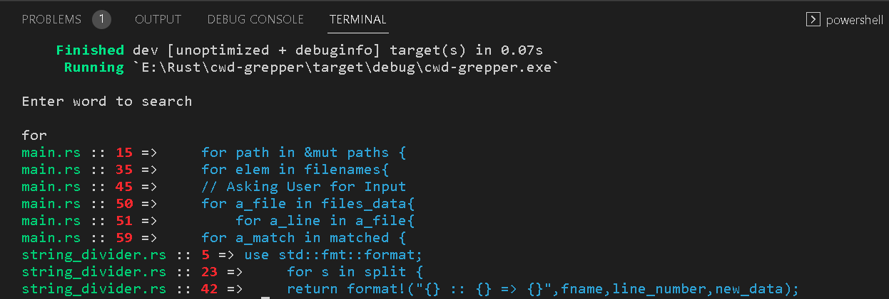

### cwd-grepper-Rust
##### A Program that searchces for a User input word in the current working directory and Returns the exact line it has been found.

### Project Illustrtion

 

## How to Use it ?
  
  - Open any Terminal 
  - Clone the repostory using <code>git clone https://github.com/umaresso/cwd-grepper-Rust cwd-grepper</code>.
  - Navigate to the Directory you have cloned the repository in.
  - Run <code>cargo build</code> and wait for dependencies to get installed.
  - Navigate to <code>src</code> directory using <code>cd src</code>
  - Insert some files in the  <code>src</code> directory
  - Run  <code>cargo run</code>
  - Type any word to search.
  - Enjoy the Results.
  - Feel free to Star the repository and follow to connect with me .

Thank you for having a look at my work :)

  
